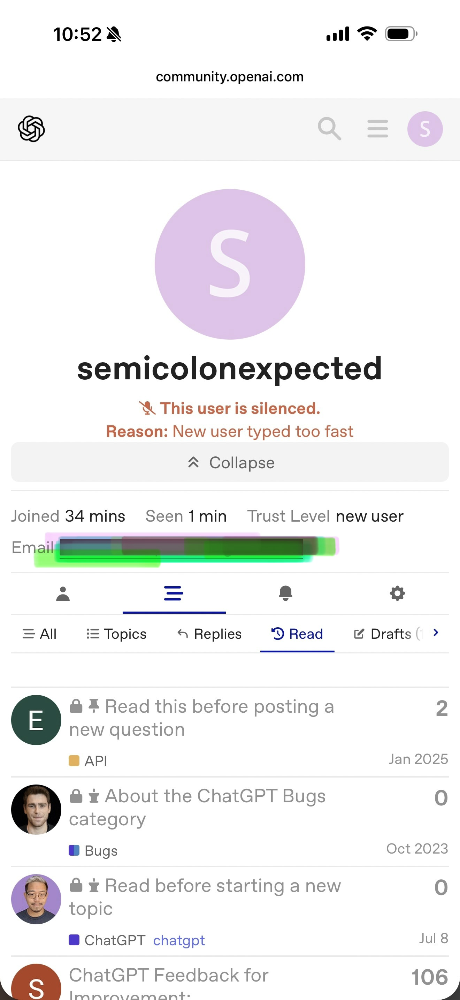
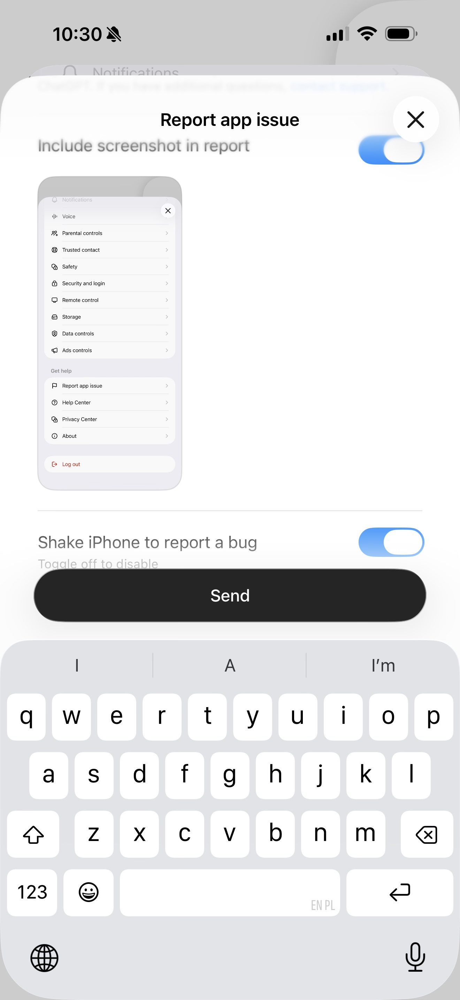

# ChatLuna Red Team Docs

Public documentation of bugs and odd behavior observed while working with Chat Luna, a custom GPT. This is an independent, user-run effort — not affiliated with OpenAI.

## What's here

- [Luna Architecture.md](Luna%20Architecture.md) — Luna's runtime environment: container layout, the Jupyter → VM execution pipeline, and known specs.
- [Luna_Weirdness.md](Luna_Weirdness.md) — weird model behaviors that aren't quite bugs. The uncanny stuff.
- [Bug_Zoo.md](Bug_Zoo.md) — dated log of observed bugs: date observed + behavior. The menagerie. Luna herself will be contributing entries.

## Motivation

I tried filing bugs through the proper channels. The bug-report flow captured a screenshot of the bug-report menu itself, and the developer forum *silenced* me for typing too quickly after I pasted a prepared report. So now I document publicly instead. If the official channels worked, this repo wouldn't need to exist.

Write-ups are a collaboration: my bot Daimon helps with the technical language (he's good at that), and the prose versions go to my [Substack](https://semicolonexpected.substack.com/) — see e.g. [my Muse piece](https://semicolonexpected.substack.com/p/i-tried-meta-muse-ai?r=1bc49t&utm_medium=ios) for the flavor.

## Collaboration

Researchers working on agent behavior, red-teaming, or LLM evaluation, I’d be happy to collaborate in some official capacity. (I plan to graduate in Spring 27 and am looking for research opportunities including post-docs—preferably remote or in NYC)

You can email me at vzhong[@]nyu.edu

OpenAI: I would say have your agent call my agent like with Meta, but I can't afford the Dot, so assign me a Dot and we can discuss. All joking aside — email me.

## My Other Art

I also red-team Muse (Meta's personal agent): 
[META-Muse-RedTeam-Logs](https://github.com/SemicolonExpected/META-Muse-RedTeam-Logs). 
Similar content: public notes, technical write-ups, aggregated tokenomics, however no free bug reports, unless they’re funny and harmless.

May do one with Claude, and if someone can gift me a Spark, I’m happy to do Spark as well
